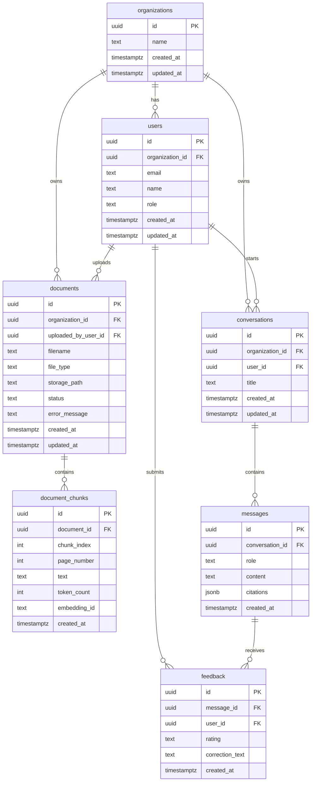

# Database Schema

This document defines the first PostgreSQL schema for Averion.ai.

The goal of this schema is to support the MVP flow:

1. A user uploads a document.
2. The backend stores document metadata.
3. The AI pipeline extracts, cleans, and chunks the document.
4. Chunks are embedded and linked to vector store records.
5. A user asks a question in a conversation.
6. The backend stores messages and citations.
7. The user gives feedback on an answer.

## Design Principles

- Keep every record scoped to an organization where needed.
- Preserve citation metadata so answers can point back to source chunks.
- Store enough feedback data to improve retrieval later.
- Avoid overbuilding enterprise permissions in the MVP.
- Make the schema easy to migrate into SQLAlchemy or another ORM later.

## Entity Relationship Overview



## Tables

### organizations

Stores company/workspace records. Even if the MVP starts with one organization, keeping this table now prevents painful rewrites later.

| Column | Type | Required | Notes |
| --- | --- | --- | --- |
| `id` | `uuid` | Yes | Primary key |
| `name` | `text` | Yes | Organization name |
| `created_at` | `timestamptz` | Yes | Creation time |
| `updated_at` | `timestamptz` | Yes | Last update time |

### users

Stores people using the product.

| Column | Type | Required | Notes |
| --- | --- | --- | --- |
| `id` | `uuid` | Yes | Primary key |
| `organization_id` | `uuid` | Yes | References `organizations.id` |
| `email` | `text` | Yes | Unique inside an organization |
| `name` | `text` | No | Display name |
| `role` | `text` | Yes | MVP values: `owner`, `member` |
| `created_at` | `timestamptz` | Yes | Creation time |
| `updated_at` | `timestamptz` | Yes | Last update time |

### documents

Stores uploaded file metadata and processing state.

| Column | Type | Required | Notes |
| --- | --- | --- | --- |
| `id` | `uuid` | Yes | Primary key |
| `organization_id` | `uuid` | Yes | References `organizations.id` |
| `uploaded_by_user_id` | `uuid` | No | References `users.id` |
| `filename` | `text` | Yes | Original file name |
| `file_type` | `text` | Yes | MVP values: `pdf`, `txt`, `docx` |
| `storage_path` | `text` | Yes | Local or object storage path |
| `status` | `text` | Yes | See document statuses below |
| `error_message` | `text` | No | Stores processing failure details |
| `created_at` | `timestamptz` | Yes | Upload time |
| `updated_at` | `timestamptz` | Yes | Last status update |

Document status values:

```text
uploaded
processing
ready
failed
```

### document_chunks

Stores searchable text chunks produced by the AI pipeline.

| Column | Type | Required | Notes |
| --- | --- | --- | --- |
| `id` | `uuid` | Yes | Primary key |
| `document_id` | `uuid` | Yes | References `documents.id` |
| `chunk_index` | `integer` | Yes | Order inside the document |
| `page_number` | `integer` | No | Available for PDFs and some DOCX extraction later |
| `text` | `text` | Yes | Chunk text used for retrieval and citations |
| `token_count` | `integer` | No | Useful for prompt limits |
| `embedding_id` | `text` | No | Vector DB id for this chunk |
| `created_at` | `timestamptz` | Yes | Creation time |

Important constraints:

- `(document_id, chunk_index)` should be unique.
- Empty chunks should never be stored.

### conversations

Stores chat sessions.

| Column | Type | Required | Notes |
| --- | --- | --- | --- |
| `id` | `uuid` | Yes | Primary key |
| `organization_id` | `uuid` | Yes | References `organizations.id` |
| `user_id` | `uuid` | No | References `users.id` |
| `title` | `text` | No | Optional display title |
| `created_at` | `timestamptz` | Yes | Creation time |
| `updated_at` | `timestamptz` | Yes | Last activity time |

### messages

Stores user and assistant messages.

| Column | Type | Required | Notes |
| --- | --- | --- | --- |
| `id` | `uuid` | Yes | Primary key |
| `conversation_id` | `uuid` | Yes | References `conversations.id` |
| `role` | `text` | Yes | Values: `user`, `assistant`, `system` |
| `content` | `text` | Yes | Message body |
| `citations` | `jsonb` | Yes | Empty array for messages without citations |
| `created_at` | `timestamptz` | Yes | Creation time |

Citation JSON shape:

```json
[
  {
    "document_id": "uuid",
    "chunk_id": "uuid",
    "filename": "policy.pdf",
    "page_number": 4,
    "snippet": "Refunds are available within..."
  }
]
```

### feedback

Stores human feedback for assistant answers.

| Column | Type | Required | Notes |
| --- | --- | --- | --- |
| `id` | `uuid` | Yes | Primary key |
| `message_id` | `uuid` | Yes | References assistant message in `messages.id` |
| `user_id` | `uuid` | No | References `users.id` |
| `rating` | `text` | Yes | Values: `up`, `down` |
| `correction_text` | `text` | No | User-provided correction |
| `created_at` | `timestamptz` | Yes | Creation time |

## Recommended Indexes

- `users(organization_id, email)`
- `documents(organization_id, status)`
- `document_chunks(document_id, chunk_index)`
- `conversations(organization_id, user_id)`
- `messages(conversation_id, created_at)`
- `feedback(message_id)`
- `feedback(user_id)`

## MVP Development Notes

For local development, create one default organization and one default user until real auth is added.

Suggested default records:

```text
Organization: Averion Demo
User: demo@averion.local
```

Later issues can turn this design into migrations and SQLAlchemy models. This issue only defines the schema contract.
