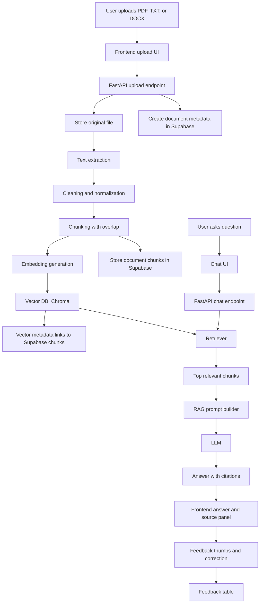

# Averion.ai Project Plan

## Product

Averion.ai is an Enterprise AI Knowledge Copilot. The MVP lets a company upload internal documents, ask questions, receive source-cited answers, inspect the source text, and give feedback when an answer is wrong.

The first version must stay narrow. Build the core intelligence before adding Slack, Notion, email, dashboards, agents, or advanced analytics.

## MVP Features

1. Document upload
   - Supported formats: PDF, TXT, DOCX.
   - Store file metadata.
   - Extract raw text.
   - Show upload status.

2. Smart chat using RAG
   - User asks a question.
   - Backend retrieves relevant document chunks.
   - LLM answers only from retrieved context.
   - Response includes citations.

3. Source highlighting
   - Show which document chunks were used.
   - Include document name, page number when available, and text snippet.
   - Let the user inspect the cited source.

4. Feedback loop
   - User can mark answers as helpful or not helpful.
   - User can write a correction.
   - Store question, answer, retrieved chunks, rating, and correction.

## Beginner-Friendly Responsibility Split

### Web developer owner

Primary owner: Shubham

Responsibilities:

- Frontend app.
- Auth-ready user interface.
- File upload flow.
- Chat interface.
- Source citation panel.
- Feedback controls.
- API route integration.
- Product polish and deployment.

### AI/ML owner

Primary owner: `workagrimag186-max`

Responsibilities:

- Text extraction and cleaning.
- Chunking strategy.
- Embedding model selection.
- Vector database setup.
- Retrieval pipeline.
- Citation mapping.
- RAG prompt design.
- Evaluation dataset and metrics.
- Feedback data format.

### Shared responsibilities

- API contract between frontend and AI backend.
- Database schema.
- GitHub issues and PR reviews.
- Demo data and final presentation.
- Security basics around uploaded files.

## Recommended Tech Stack

### Frontend

- Next.js with TypeScript.
- Tailwind CSS.
- shadcn/ui or a small internal component set.
- React Query or SWR for client data fetching.

### Backend

- FastAPI for the AI/backend service.
- Python 3.11+.
- Pydantic for request and response validation.
- PostgreSQL for metadata, users, documents, chat history, and feedback.
- Supabase Postgres for the hosted MVP database.

### AI

- LangChain for early RAG orchestration.
- Sentence Transformers for embeddings.
- Chroma for local vector search.
- Hugging Face Transformers for models and tokenizers.
- PyTorch later for fine-tuning embedding or reranker models.
- TensorFlow later for a small document classifier or intent classifier.

### Development and testing

- Gradio for AI pipeline testing only.
- Pytest for backend tests.
- Playwright for frontend flow tests later.
- GitHub Issues, labels, milestones, and Projects for planning.

## Architecture



## RAG Flow Explained

The LLM is not trained on company data in the MVP. Training would be slow, expensive, hard to update, and risky because company data changes constantly. Instead, use RAG:

1. Break documents into searchable chunks.
2. Convert every chunk into an embedding vector.
3. Convert the user's question into an embedding vector.
4. Find chunks with similar vectors.
5. Put those chunks into the LLM prompt.
6. Ask the LLM to answer using only the provided context.
7. Return the answer with citations back to the exact chunks.

Good retrieval matters more than a fancy model. If the wrong chunks are retrieved, the answer will be weak even with a strong LLM.

## Chunking Rules For MVP

Start simple:

- Chunk size: 600 to 900 tokens.
- Overlap: 100 to 150 tokens.
- Preserve metadata:
  - document id
  - filename
  - page number if available
  - chunk index
  - character start and end offsets if possible
- Do not split in the middle of headings when avoidable.

Improve later:

- Semantic chunking.
- Section-aware chunking.
- Table extraction.
- Reranking.

## Database Tables

See the detailed schema contract in [Database Schema](DATABASE_SCHEMA.md).
See setup instructions in [Supabase Setup](SUPABASE_SETUP.md).

### organizations

- id
- name
- created_at

### users

- id
- organization_id
- email
- name
- role
- created_at

### documents

- id
- organization_id
- uploaded_by_user_id
- filename
- file_type
- storage_path
- status
- error_message
- created_at

### document_chunks

- id
- document_id
- chunk_index
- page_number
- text
- token_count
- embedding_id
- created_at

### conversations

- id
- organization_id
- user_id
- title
- created_at

### messages

- id
- conversation_id
- role
- content
- citations_json
- created_at

### feedback

- id
- message_id
- user_id
- rating
- correction_text
- created_at

## API Contract

### POST /documents/upload

Uploads a document.

Content type: `multipart/form-data`

Form field:

```text
file
```

Response:

```json
{
  "document_id": "doc_123",
  "filename": "handbook.pdf",
  "file_type": "pdf",
  "status": "uploaded",
  "storage_path": "uploads/doc_123/handbook.pdf",
  "metadata_stored": true,
  "chunks_stored": 3
}
```

### GET /documents

Returns uploaded documents and processing status.

### POST /chat

Sends a user question.

Request:

```json
{
  "conversation_id": "conv_123",
  "question": "What is our refund policy?"
}
```

Response:

```json
{
  "answer": "The refund policy allows...",
  "citations": [
    {
      "document_id": "doc_123",
      "filename": "policy.pdf",
      "page_number": 4,
      "chunk_id": "doc_123:0",
      "chunk_index": 0,
      "snippet": "Refunds are available within..."
    }
  ]
}
```

### POST /feedback

Stores user feedback.

Request:

```json
{
  "message_id": "msg_123",
  "rating": "down",
  "correction_text": "The answer missed the 30-day condition."
}
```

## Milestones

### Milestone 0: Project setup

Goal: Both developers can run the project locally.

Deliverables:

- Repo structure.
- README setup guide.
- Frontend app starts.
- Backend app starts.
- Environment variable examples.
- Basic CI.

### Milestone 1: Document ingestion

Goal: Upload files and create clean text chunks.

Deliverables:

- Upload endpoint.
- PDF, TXT, DOCX extraction.
- Cleaning pipeline.
- Chunking pipeline.
- Metadata storage.
- Basic ingestion tests.

### Milestone 2: Retrieval

Goal: Search uploaded documents semantically.

Deliverables:

- Embedding generation.
- Vector DB persistence.
- Similarity search endpoint.
- Retrieval evaluation with sample questions.
- Vector results include `document_id`, `chunk_index`, and `chunk_id`.

### Milestone 2.5: Supabase database integration

Goal: Persist product data in Supabase before building chat.

Deliverables:

- Supabase schema applied and verified.
- Backend database connection health check.
- Uploaded document metadata stored in Supabase.
- Extracted chunks stored in `document_chunks`.
- Documents page lists Supabase-backed uploads.
- Chroma vector metadata links back to Supabase chunks.

### Milestone 3: RAG chat

Goal: Ask questions and receive grounded answers.

Deliverables:

- Chat API.
- RAG prompt.
- LLM integration.
- Citations in response.
- Chat UI.

### Milestone 4: Source highlighting and feedback

Goal: Make answers inspectable and improveable.

Deliverables:

- Citation source panel.
- Highlighted snippets.
- Feedback thumbs.
- Correction text input.
- Feedback storage.

### Milestone 5: Product finish

Goal: A polished demo-ready SaaS MVP.

Deliverables:

- Auth placeholder or basic auth.
- Organization scoping in schema.
- Error states.
- Empty states.
- Loading states.
- Demo data.
- Deployment plan.

## What Not To Build Yet

- Slack integration.
- Notion integration.
- Email ingestion.
- Multi-agent workflows.
- Fine-tuning.
- TensorFlow classifier.
- Analytics dashboard.
- Complex role-based permissions.
- Enterprise admin panel.

These are good future features, but they will distract from the real MVP.
